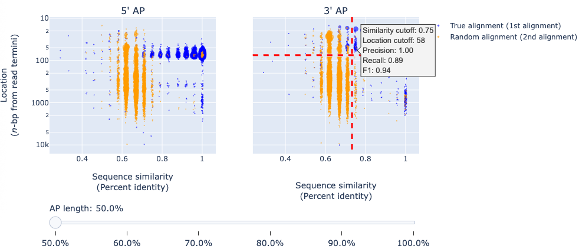

Output
======

NanoPrePro produces two main outputs:

- **Processed FASTQ files** with per-read annotations
- **HTML report** summarizing preprocessing results

.. _per_read_annotation:

Processed FASTQ
---------------

NanoPrePro appends preprocessing annotations to the FASTQ read IDs.  
These annotations use standardized flags, summarized below:

================ ============ ======= ==========================================================
flag             regex        default explanation
================ ============ ======= ==========================================================
``strand``       -?\d+\.\d*   0       0: unknown; > 0: sense; < 0: antisense
``full_length``  [0|1]        0       0: non-full-length; 1: full-length
``fusion``       [0|1]        0       0: non-chimeric/fusion; 1: chimeric/fusion
``ploc5``        -?\d+        -1      -1: unknown; 0: removed; > 0: 5' adapter/primer location
``ploc3``        -?\d+        -1      -1: unknown; 0: removed; > 0: 3' adapter/primer location
``poly5``        -?\d+        0       0: unknown; > 0: 5' poly length; < 0: trimmed 5' poly
``poly3``        -?\d+        0       0: unknown; > 0: 3' poly length; < 0: trimmed 3' poly
================ ============ ======= ==========================================================

+----------------+----------------+---------+----------------------------------------------------------+
| flag           | regex          | default | explanation                                              |
+================+================+=========+==========================================================+
| ``strand``     | -?\d+\.\d*     | 0       | 0: unknown; > 0: sense; < 0: antisense                   |
+----------------+----------------+---------+----------------------------------------------------------+
| ``full_length``| [0\|1]         | 0       | 0: non-full-length; 1: full-length                       |
+----------------+----------------+---------+----------------------------------------------------------+
| ``fusion``     | [0\|1]         | 0       | 0: non-chimeric/fusion; 1: chimeric/fusion               |
+----------------+----------------+---------+----------------------------------------------------------+
| ``ploc5``      | -?\d+          | -1      | -1: unknown; 0: removed; > 0: 5' adapter/primer location |
+----------------+----------------+---------+----------------------------------------------------------+
| ``ploc3``      | -?\d+          | -1      | -1: unknown; 0: removed; > 0: 3' adapter/primer location |
+----------------+----------------+---------+----------------------------------------------------------+
| ``poly5``      | -?\d+          | 0      | 0: unknown; > 0: 5' poly length; < 0: trimmed 5' poly    |
+----------------+----------------+---------+----------------------------------------------------------+
| ``poly3``      | -?\d+          | 0      | 0: unknown; > 0: 3' poly length; < 0: trimmed 3' poly    |
+----------------+----------------+---------+----------------------------------------------------------+

**Example**

.. code-block:: bash

   @read_1 strand=0.91 full_length=1 fusion=0 ploc5=0 ploc3=0 poly5=0 poly3=-20
   AGAGGCTGGCGGGAACGGGC......TTTCAAAGCCAGGCGGATTC
   +
   +,),+'$)'%671*%('&$%......((&'(*($%$&%&$-((84*

This example shows that *read_1* is:

- Sense strand (``strand=0.91``)  
- Full-length (``full_length=1``)  
- Non-chimeric (``fusion=0``)  
- Adapter/primer removed (``ploc5=0 ploc3=0``)  
- PolyA trimmed (``poly3=-20``)  

.. _html_report:

HTML Report
-----------

The HTML report provides an overview of preprocessing results, including:

- Quality score histograms  
- Proportion of filtered/passed full-length, truncated, and chimeric reads  
- Simulated real/random adapter/primer alignment results with interactive cutoff exploration  

.. _guideline:

Choosing Cutoffs from Simulated Real/Random Alignment Results
~~~~~~~~~~~~~~~~~~~~~~~~~~~~~~~~~~~~~~~~~~~~~~~

The report includes an interactive plot of simulated **true** and **random** alignments.  

- **X-axis**: sequence similarity  
- **Y-axis**: aligned location  
- **Blue dots**: true alignments  
- **Orange dots**: random alignments  

A slider allows switching between results for different adapter/primer substring lengths.  
Hovering over the plot displays precision, recall, and F-score under specific cutoff settings.

**Guidelines**  

- Higher precision: use higher sequence similarity cutoffs and longer adapter/primer substrings.  
- Higher recall: use lower similarity cutoffs and shorter adapter/primer substrings.  

⚠️ *Note:* Increasing adapter/primer length too far can be counterproductive. 
Basecalling accuracy often drops near read termini, making the last nucleotides unreliable. 
Stop increasing the adapter/primer length once most blue dots begin deviating from sequence similarity = 1.

